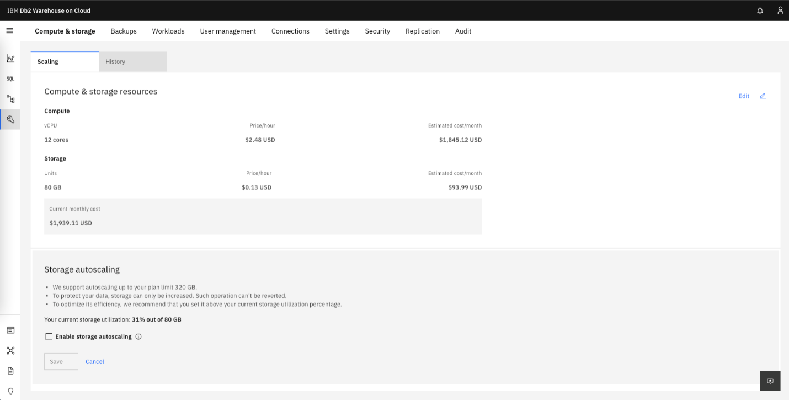

---

copyright:
  years: 2014, 2023
lastupdated: "2023-07-08"

keywords:

subcollection: Db2whc

---

# Scaling

{: #scale}

<!-- Attribute definitions -->
{:external: target="_blank" .external}
{:shortdesc: .shortdesc}
{:codeblock: .codeblock}
{:screen: .screen}
{:tip: .tip}
{:important: .important}
{:note: .note}
{:deprecated: .deprecated}
{:pre: .pre}

{{site.data.keyword.dashdblong}} provides you with the ability to independently scale compute and storage. You can use the console to scale resources immediately or to schedule a scaling operation, or you can scale your instance programmatically using the REST API.
{: shortdesc}

To use the console, click **Administration** and then click the **Scaling** tab on the **Compute & storage** page.

{: caption="Figure 1. A screenshot of the Scaling tab" caption-side="bottom"}

For information about using the REST API to scale compute or storage, see [REST API](https://cloud.ibm.com/apidocs/db2-warehouse-on-cloud){: external}.

On-demand scaling is charged on an hourly basis. This allows you to pay for additional resources only when they are needed. For example, you can scale up compute if your workload is heavier on weekdays, and then scale it down for the weekend.

<!---->

## Compute Scaling

With all plans, you can scale compute up or down. Memory is scaled up or down proportionally as you scale compute resources up or down.
During compute scaling, all uncommitted transactions are rolled back. 

Approximately 45 minutes of downtime is required for a compute scale operation. The downtime will vary depending on the amount of crash recovery processing that might be required. The best practice is to gracefully end workloads prior to a scaling operation, or to schedule the scaling operation during a low period of activity.

## Storage Scaling

With the current generation of plans hosted on AWS, you can scale storage up or down. The ability to scale storage down allows you to reduce your costs as you move data from more expensive block storage to less expensive cloud storage. With all other plans, you can only scale storage up.

You can also enable auto-scaling for your storage. When you enable autoscaling, the storage on your Db2 Warehouse on Cloud instance will automatically be scaled up if your storage use exceeds the threshold you specify. The following screenshot shows the auto-scaling panel in the console for a Db2 Warehouse on Cloud Flex instance hosted on IBM Cloud.

{: caption="Figure 2. A screenshot of the autoscaling tab" caption-side="bottom"}

Scaling storage up is an online operation. Scaling storage down requires downtime.
